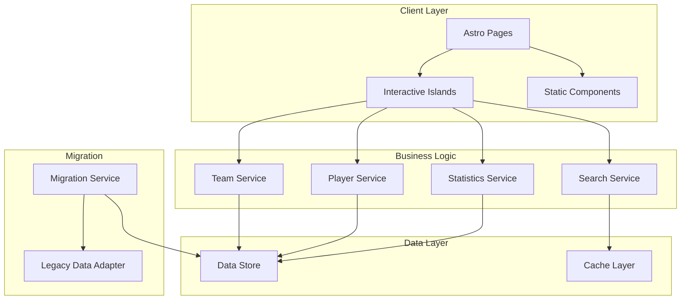

# Design Document: Fantasy Sports Tracker

## Overview

The Fantasy Sports Tracker is a modernized web application built with Astro that enables users to track and manage fantasy sports teams across multiple sports (football, basketball, baseball, hockey). This design represents a complete rewrite of an existing React 15.6.1-based fantasy football tracker, leveraging Astro's modern architecture for optimal performance through static site generation, partial hydration, and minimal JavaScript delivery.

The application follows a component-based architecture with clear separation between:
- **Static content** rendered at build time using Astro components
- **Interactive islands** for dynamic functionality using framework-agnostic components
- **Data layer** for persistence and state management
- **Migration utilities** for preserving existing user data

Key design principles:
- **Performance-first**: Leverage Astro's zero-JS-by-default approach
- **Progressive enhancement**: Core functionality works without JavaScript
- **Sport-agnostic core**: Extensible architecture supporting multiple sports
- **Data preservation**: Seamless migration from legacy application

## Architecture

### High-Level Architecture



### Technology Stack

- **Framework**: Astro 4.x
- **Styling**: CSS Modules with modern CSS features
- **Interactive Components**: Vanilla JavaScript with optional framework integration
- **Data Storage**: Browser localStorage for client-side persistence (with future API integration capability)
- **Build Tool**: Vite (bundled with Astro)
- **Type Safety**: TypeScript for type checking

### Directory Structure

```
src/
├── components/
│   ├── core/              # Reusable UI components
│   │   ├── Button.astro
│   │   ├── Card.astro
│   │   └── Navigation.astro
│   ├── sport/             # Sport-specific components
│   │   ├── SportSelector.astro
│   │   └── StatDisplay.astro
│   ├── team/              # Team management components
│   │   ├── TeamCard.astro
│   │   ├── TeamList.astro
│   │   └── TeamEditor.island.js
│   └── player/            # Player components
│       ├── PlayerCard.astro
│       ├── PlayerSearch.island.js
│       └── PlayerStats.astro
├── layouts/
│   ├── BaseLayout.astro   # Main layout wrapper
│   └── SportLayout.astro  # Sport-specific layout
├── pages/
│   ├── index.astro        # Home page
│   ├── teams/
│   │   ├── index.astro    # Team list
│   │   └── [id].astro     # Team detail
│   ├── players/
│   │   ├── index.astro    # Player search
│   │   └── [id].astro     # Player detail
│   └── migrate.astro      # Migration utility page
├── services/
│   ├── teamService.ts
│   ├── playerService.ts
│   ├── statsService.ts
│   ├── searchService.ts
│   └── migrationService.ts
├── models/
│   ├── Team.ts
│   ├── Player.ts
│   ├── Sport.ts
│   └── Statistics.ts
├── utils/
│   ├── storage.ts         # LocalStorage abstraction
│   ├── validation.ts      # Data validation
│   └── sportConfig.ts     # Sport-specific configurations
└── styles/
    ├── global.css
    └── variables.css
```

## Components and Interfaces

### Core Services

#### TeamService

Manages team creation, modification, and retrieval.

```typescript
interface TeamService {
  // Create a new team
  createTeam(name: string, sportType: SportType): Promise<Team>;
  
  // Get team by ID
  getTeam(id: string): Promise<Team | null>;
  
  // Get all teams for current user
  getAllTeams(): Promise<Team[]>;
  
  // Get teams filtered by sport
  getTeamsBySport(sportType: SportType): Promise<Team[]>;
  
  // Update team details
  updateTeam(id: string, updates: Partial<Team>): Promise<Team>;
  
  // Delete team
  deleteTeam(id: string): Promise<void>;
  
  // Add player to team
  addPlayerToTeam(teamId: string, playerId: string): Promise<void>;
  
  // Remove player from team
  removePlayerFromTeam(teamId: string, playerId: string): Promise<void>;
}
```

#### PlayerService

Manages player data and statistics.

```typescript
interface PlayerService {
  // Get player by ID
  getPlayer(id: string): Promise<Player | null>;
  
  // Get all players for a sport
  getPlayersBySport(sportType: SportType): Promise<Player[]>;
  
  // Get players on a specific team
  getPlayersForTeam(teamId: string): Promise<Player[]>;
  
  // Update player statistics
  updatePlayerStats(playerId: string, stats: Statistics): Promise<void>;
  
  // Create new player (for migration)
  createPlayer(player: Omit<Player, 'id'>): Promise<Player>;
}
```

#### StatsService

Handles sport-specific statistics calculations and formatting.

```typescript
interface StatsService {
  // Get statistics for a player
  getPlayerStats(playerId: string, sportType: SportType): Promise<Statistics>;
  
  // Get aggregated team statistics
  getTeamStats(teamId: string): Promise<Statistics>;
  
  // Format statistics for display
  formatStats(stats: Statistics, sportType: SportType): FormattedStats;
  
  // Get stat definitions for a sport
  getStatDefinitions(sportType: SportType): StatDefinition[];
  
  // Compare players by statistics
  comparePlayers(playerIds: string[], statKey: string): ComparisonResult;
}
```

#### SearchService

Provides search and filtering capabilities.

```typescript
interface SearchService {
  // Search players by name
  searchPlayers(query: string, sportType?: SportType): Promise<Player[]>;
  
  // Filter players by criteria
  filterPlayers(filters: PlayerFilters): Promise<Player[]>;
  
  // Sort players by statistic
  sortPlayers(players: Player[], sortBy: string, order: 'asc' | 'desc'): Player[];
  
  // Get search suggestions
  getSuggestions(query: string): Promise<string[]>;
}
```

#### MigrationService

Handles data migration from the legacy React application.

```typescript
interface MigrationService {
  // Migrate all data from legacy app
  migrateAll(): Promise<MigrationResult>;
  
  // Migrate teams
  migrateTeams(legacyData: any): Promise<Team[]>;
  
  // Migrate players
  migratePlayers(legacyData: any): Promise<Player[]>;
  
  // Validate migrated data
  validateMigration(): Promise<ValidationResult>;
  
  // Rollback migration if needed
  rollback(): Promise<void>;
}
```

### Interactive Islands

Interactive islands are components that require client-side JavaScript. They use Astro's island architecture for optimal performance.

#### TeamEditor Island

```typescript
// TeamEditor.island.js
interface TeamEditorProps {
  teamId?: string;
  sportType: SportType;
  onSave: (team: Team) => void;
}

class TeamEditor {
  // Initialize editor with team data
  init(props: TeamEditorProps): void;
  
  // Handle form submission
  handleSubmit(event: Event): void;
  
  // Add player to roster
  addPlayer(playerId: string): void;
  
  // Remove player from roster
  removePlayer(playerId: string): void;
  
  // Validate team before saving
  validate(): ValidationResult;
}
```

#### PlayerSearch Island

```typescript
// PlayerSearch.island.js
interface PlayerSearchProps {
  sportType?: SportType;
  onSelect?: (player: Player) => void;
}

class PlayerSearch {
  // Initialize search interface
  init(props: PlayerSearchProps): void;
  
  // Handle search input
  handleSearch(query: string): void;
  
  // Apply filters
  applyFilters(filters: PlayerFilters): void;
  
  // Handle player selection
  selectPlayer(playerId: string): void;
  
  // Debounced search execution
  executeSearch(): Promise<void>;
}
```

## Data Models

### Core Data Types

```typescript
// Sport types supported by the application
type SportType = 'football' | 'basketball' | 'baseball' | 'hockey';

// Team model
interface Team {
  id: string;
  name: string;
  sportType: SportType;
  playerIds: string[];
  createdAt: Date;
  updatedAt: Date;
}

// Player model
interface Player {
  id: string;
  name: string;
  sportType: SportType;
  position: string;
  teamAffiliation: string; // Real-world team (e.g., "Dallas Cowboys")
  statistics: Statistics;
  createdAt: Date;
  updatedAt: Date;
}

// Statistics model (sport-agnostic container)
interface Statistics {
  sportType: SportType;
  season: string;
  stats: Record<string, number | string>;
}

// Sport-specific stat definitions
interface FootballStats {
  passingYards: number;
  rushingYards: number;
  touchdowns: number;
  receptions: number;
  interceptions?: number;
}

interface BasketballStats {
  points: number;
  rebounds: number;
  assists: number;
  steals: number;
  blocks: number;
}

interface BaseballStats {
  battingAverage: number;
  homeRuns: number;
  rbis: number;
  era?: number;
  strikeouts: number;
}

interface HockeyStats {
  goals: number;
  assists: number;
  plusMinus: number;
  penaltyMinutes: number;
  saves?: number;
}

// Search and filter types
interface PlayerFilters {
  sportType?: SportType;
  position?: string;
  teamAffiliation?: string;
  minStat?: { key: string; value: number };
  maxStat?: { key: string; value: number };
}

// Migration types
interface MigrationResult {
  success: boolean;
  teamsCreated: number;
  playersCreated: number;
  errors: MigrationError[];
}

interface MigrationError {
  type: 'team' | 'player' | 'stats';
  message: string;
  data: any;
}

// Validation types
interface ValidationResult {
  valid: boolean;
  errors: ValidationError[];
}

interface ValidationError {
  field: string;
  message: string;
}
```

### Data Storage Schema

The application uses browser localStorage with the following key structure:

```typescript
// Storage keys
const STORAGE_KEYS = {
  TEAMS: 'fantasy-tracker:teams',
  PLAYERS: 'fantasy-tracker:players',
  USER_PREFS: 'fantasy-tracker:preferences',
  MIGRATION_STATUS: 'fantasy-tracker:migration-status'
};

// Storage format
interface StorageData {
  teams: Record<string, Team>;
  players: Record<string, Player>;
  preferences: UserPreferences;
  migrationStatus: MigrationStatus;
}

interface UserPreferences {
  defaultSport: SportType;
  theme: 'light' | 'dark';
  sortPreference: string;
}

interface MigrationStatus {
  completed: boolean;
  timestamp: Date;
  version: string;
}
```

### Sport Configuration

Each sport has a configuration defining its specific attributes:

```typescript
interface SportConfig {
  type: SportType;
  displayName: string;
  positions: string[];
  statDefinitions: StatDefinition[];
  primaryStats: string[]; // Stats to display prominently
  sortableStats: string[]; // Stats available for sorting
}

interface StatDefinition {
  key: string;
  displayName: string;
  format: 'number' | 'decimal' | 'percentage';
  description: string;
}

// Example configuration
const FOOTBALL_CONFIG: SportConfig = {
  type: 'football',
  displayName: 'Football',
  positions: ['QB', 'RB', 'WR', 'TE', 'K', 'DEF'],
  statDefinitions: [
    { key: 'passingYards', displayName: 'Pass Yds', format: 'number', description: 'Passing yards' },
    { key: 'rushingYards', displayName: 'Rush Yds', format: 'number', description: 'Rushing yards' },
    { key: 'touchdowns', displayName: 'TDs', format: 'number', description: 'Touchdowns' },
    { key: 'receptions', displayName: 'Rec', format: 'number', description: 'Receptions' }
  ],
  primaryStats: ['passingYards', 'rushingYards', 'touchdowns'],
  sortableStats: ['passingYards', 'rushingYards', 'touchdowns', 'receptions']
};
```


## Correctness Properties

A property is a characteristic or behavior that should hold true across all valid executions of a system—essentially, a formal statement about what the system should do. Properties serve as the bridge between human-readable specifications and machine-verifiable correctness guarantees.

### Property 1: Sport-specific statistics display

*For any* player and their associated sport type, when displaying that player's statistics, the displayed statistics should match the stat definitions configured for that sport type.

**Validates: Requirements 2.5, 2.6, 5.1**

### Property 2: Multi-sport team management

*For any* set of teams with different sport types, creating and managing teams of one sport type should not interfere with teams of other sport types.

**Validates: Requirements 2.7**

### Property 3: Complete data migration

*For any* legacy dataset containing teams, players, and statistics, the migration service should extract all valid data items and make them accessible in the new system.

**Validates: Requirements 3.1, 3.2, 3.3, 3.5**

### Property 4: Migration schema transformation

*For any* valid legacy data item, after migration the transformed data should conform to the new data schema.

**Validates: Requirements 3.4**

### Property 5: Migration error handling

*For any* dataset containing both valid and invalid entries, the migration service should process all valid entries and log errors for invalid entries without stopping.

**Validates: Requirements 3.6**

### Property 6: Team creation validation

*For any* team creation attempt, the system should reject attempts that lack a team name or sport type.

**Validates: Requirements 4.1**

### Property 7: Player roster management

*For any* team and valid player, adding the player to the team then removing the player should return the team to its original state (round-trip property).

**Validates: Requirements 4.2, 4.3**

### Property 8: Data persistence round-trip

*For any* team or player, creating it then retrieving it should return an equivalent object with all modifications persisted.

**Validates: Requirements 4.4, 8.1, 8.2**

### Property 9: Team retrieval completeness

*For any* set of teams created by a user, retrieving all teams should return exactly those teams with no duplicates or omissions.

**Validates: Requirements 4.5**

### Property 10: Team display completeness

*For any* team with players, displaying the team should include all players on that team with their current statistics.

**Validates: Requirements 4.6**

### Property 11: Player comparison functionality

*For any* set of players, the comparison function should successfully compare them by any valid statistic key.

**Validates: Requirements 5.7**

### Property 12: Save operation retry

*For any* save operation that fails, the system should attempt to retry the operation before notifying the user.

**Validates: Requirements 8.4**

### Property 13: Concurrent operation consistency

*For any* sequence of concurrent data modifications, the final state should be consistent and reflect all operations without data loss.

**Validates: Requirements 8.5**

### Property 14: Backup and recovery round-trip

*For any* system state, creating a backup then performing recovery should restore the system to an equivalent state.

**Validates: Requirements 8.6**

### Property 15: Player filtering correctness

*For any* filter criteria (sport type, position, or team affiliation), the filtered results should contain only players matching that criteria.

**Validates: Requirements 9.3, 9.4, 9.5**

### Property 16: Search result sorting

*For any* sort criteria and order (ascending/descending), the search results should be correctly ordered by that statistic.

**Validates: Requirements 9.6**

### Property 17: Configuration validation

*For any* invalid configuration, the system should fail with a clear error message indicating what is invalid.

**Validates: Requirements 10.5**

## Error Handling

### Error Categories

The application handles errors in the following categories:

1. **Validation Errors**: Invalid user input or data that doesn't meet requirements
2. **Storage Errors**: Failures in persisting or retrieving data from localStorage
3. **Migration Errors**: Issues during data migration from legacy application
4. **Not Found Errors**: Requested resources that don't exist
5. **Configuration Errors**: Invalid or missing configuration

### Error Handling Strategy

```typescript
interface AppError {
  type: ErrorType;
  message: string;
  details?: any;
  timestamp: Date;
}

type ErrorType = 
  | 'validation'
  | 'storage'
  | 'migration'
  | 'not_found'
  | 'configuration';

class ErrorHandler {
  // Log error for debugging
  logError(error: AppError): void;
  
  // Display user-friendly error message
  displayError(error: AppError): void;
  
  // Attempt recovery for recoverable errors
  attemptRecovery(error: AppError): Promise<boolean>;
  
  // Report critical errors
  reportCritical(error: AppError): void;
}
```

### Error Handling Patterns

**Validation Errors**:
- Validate input before processing
- Return clear validation messages
- Highlight invalid fields in UI
- Prevent submission until valid

**Storage Errors**:
- Retry failed operations (up to 3 attempts)
- Notify user of persistence failures
- Maintain in-memory state during failures
- Provide manual retry option

**Migration Errors**:
- Log all migration errors with context
- Continue processing valid data
- Provide migration summary with error count
- Allow manual review of failed items

**Not Found Errors**:
- Return null/undefined for missing items
- Display "not found" messages in UI
- Suggest alternative actions
- Redirect to valid pages

**Configuration Errors**:
- Fail fast on startup
- Display clear error messages
- Indicate which configuration is invalid
- Prevent application from running with invalid config

### Graceful Degradation

When errors occur, the application should degrade gracefully:

1. **Core functionality preserved**: Basic viewing and navigation should work even if some features fail
2. **Cached data used**: Display cached data when fresh data unavailable
3. **Offline capability**: Core features work without network connectivity
4. **Progressive enhancement**: Advanced features fail without breaking basic features

## Testing Strategy

### Dual Testing Approach

The application will use both unit testing and property-based testing for comprehensive coverage:

- **Unit tests**: Verify specific examples, edge cases, and error conditions
- **Property tests**: Verify universal properties across all inputs

Both approaches are complementary and necessary. Unit tests catch concrete bugs and validate specific scenarios, while property tests verify general correctness across a wide range of inputs.

### Property-Based Testing

**Library**: fast-check (for JavaScript/TypeScript)

**Configuration**:
- Minimum 100 iterations per property test
- Each test tagged with feature name and property reference
- Tag format: `Feature: fantasy-sports-tracker, Property {number}: {property_text}`

**Property Test Examples**:

```typescript
// Property 8: Data persistence round-trip
test('Feature: fantasy-sports-tracker, Property 8: Data persistence round-trip', () => {
  fc.assert(
    fc.property(
      fc.record({
        name: fc.string({ minLength: 1 }),
        sportType: fc.constantFrom('football', 'basketball', 'baseball', 'hockey'),
        playerIds: fc.array(fc.uuid())
      }),
      (teamData) => {
        // Create team
        const team = teamService.createTeam(teamData.name, teamData.sportType);
        team.playerIds = teamData.playerIds;
        teamService.updateTeam(team.id, team);
        
        // Retrieve team
        const retrieved = teamService.getTeam(team.id);
        
        // Verify equivalence
        expect(retrieved).toEqual(team);
      }
    ),
    { numRuns: 100 }
  );
});

// Property 15: Player filtering correctness
test('Feature: fantasy-sports-tracker, Property 15: Player filtering correctness', () => {
  fc.assert(
    fc.property(
      fc.array(generatePlayer()),
      fc.constantFrom('football', 'basketball', 'baseball', 'hockey'),
      (players, sportFilter) => {
        // Store players
        players.forEach(p => playerService.createPlayer(p));
        
        // Filter by sport
        const filtered = searchService.filterPlayers({ sportType: sportFilter });
        
        // Verify all results match filter
        expect(filtered.every(p => p.sportType === sportFilter)).toBe(true);
      }
    ),
    { numRuns: 100 }
  );
});
```

### Unit Testing

**Framework**: Vitest (integrated with Vite/Astro)

**Coverage Areas**:
- Service layer functions
- Data validation logic
- Error handling paths
- Edge cases (empty arrays, null values, boundary conditions)
- Integration between services

**Unit Test Examples**:

```typescript
// Test specific sport configurations
describe('Sport Configuration', () => {
  test('football config includes required positions', () => {
    const config = getSportConfig('football');
    expect(config.positions).toContain('QB');
    expect(config.positions).toContain('RB');
    expect(config.positions).toContain('WR');
  });
  
  test('basketball config includes required stats', () => {
    const config = getSportConfig('basketball');
    expect(config.statDefinitions.map(s => s.key)).toContain('points');
    expect(config.statDefinitions.map(s => s.key)).toContain('rebounds');
    expect(config.statDefinitions.map(s => s.key)).toContain('assists');
  });
});

// Test error handling
describe('Error Handling', () => {
  test('creating team without name throws validation error', () => {
    expect(() => {
      teamService.createTeam('', 'football');
    }).toThrow('Team name is required');
  });
  
  test('storage failure triggers retry mechanism', async () => {
    const mockStorage = jest.fn()
      .mockRejectedValueOnce(new Error('Storage failed'))
      .mockResolvedValueOnce({ success: true });
    
    const result = await teamService.saveWithRetry(mockStorage);
    
    expect(mockStorage).toHaveBeenCalledTimes(2);
    expect(result.success).toBe(true);
  });
});

// Test migration edge cases
describe('Migration Service', () => {
  test('empty legacy data returns empty result', () => {
    const result = migrationService.migrateAll({});
    expect(result.teamsCreated).toBe(0);
    expect(result.playersCreated).toBe(0);
  });
  
  test('invalid team data logged as error', () => {
    const legacyData = {
      teams: [{ name: 'Valid Team' }, { /* missing name */ }]
    };
    
    const result = migrationService.migrateTeams(legacyData);
    
    expect(result.errors).toHaveLength(1);
    expect(result.errors[0].type).toBe('team');
  });
});
```

### Integration Testing

Test interactions between components:

- Team creation → Player addition → Team retrieval
- Search → Filter → Sort → Display
- Migration → Validation → Data access
- Error occurrence → Retry → User notification

### Testing Best Practices

1. **Keep unit tests focused**: Test one thing per test
2. **Use property tests for general rules**: Let randomization find edge cases
3. **Test error paths**: Ensure errors are handled gracefully
4. **Mock external dependencies**: Isolate units under test
5. **Test with realistic data**: Use representative examples
6. **Maintain test independence**: Tests should not depend on each other
7. **Balance coverage**: Don't over-test with unit tests when properties suffice

### Test Data Generators

For property-based testing, create generators for domain objects:

```typescript
// Generator for valid players
const generatePlayer = () => fc.record({
  id: fc.uuid(),
  name: fc.string({ minLength: 1, maxLength: 50 }),
  sportType: fc.constantFrom('football', 'basketball', 'baseball', 'hockey'),
  position: fc.string({ minLength: 1, maxLength: 10 }),
  teamAffiliation: fc.string({ minLength: 1, maxLength: 50 }),
  statistics: generateStatistics()
});

// Generator for valid teams
const generateTeam = () => fc.record({
  id: fc.uuid(),
  name: fc.string({ minLength: 1, maxLength: 50 }),
  sportType: fc.constantFrom('football', 'basketball', 'baseball', 'hockey'),
  playerIds: fc.array(fc.uuid(), { maxLength: 20 }),
  createdAt: fc.date(),
  updatedAt: fc.date()
});

// Generator for sport-specific statistics
const generateStatistics = () => fc.record({
  sportType: fc.constantFrom('football', 'basketball', 'baseball', 'hockey'),
  season: fc.string(),
  stats: fc.dictionary(fc.string(), fc.oneof(fc.integer(), fc.float()))
});
```
